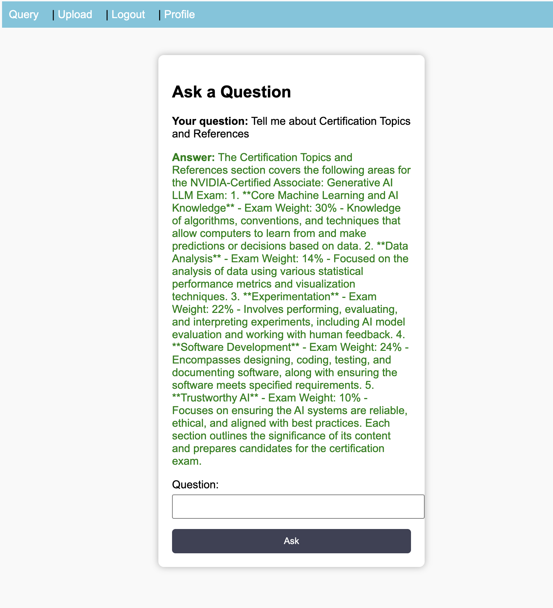

# Distributed RAG Chatbot powered by FastAPI

## Project Overview and Architecture

This project implements a secure, scalable, and highly available Retrieval-Augmented Generation (RAG) system. It is designed as a multi-tenant platform, ensuring users can only retrieve information from documents they have personally uploaded. The system employs an event-driven, microservices architecture to cleanly separate slow processing tasks from the fast API layer, enhancing both scalability and resilience.

## Technologies Used

- **FastAPI**  
- **Celery**  
- **Redis**  
- **MongoDB**  
- **FAISS**
- **Kafka**  
- **Docker**
  
## Core Features and Security Implementations

- **Decoupling Architecture**: The system separates the API layer from document processing tasks, allowing for better performance and fault tolerance.

- **Multi-Tenancy**: Each user can only access their own documents, ensuring data privacy and security.

- **Event-Driven Microservices**: The architecture separates concerns, allowing for independent scaling and maintenance of services.

- **Secure Document Handling**: Uploaded documents are processed in isolated environments, preventing unauthorized access.

