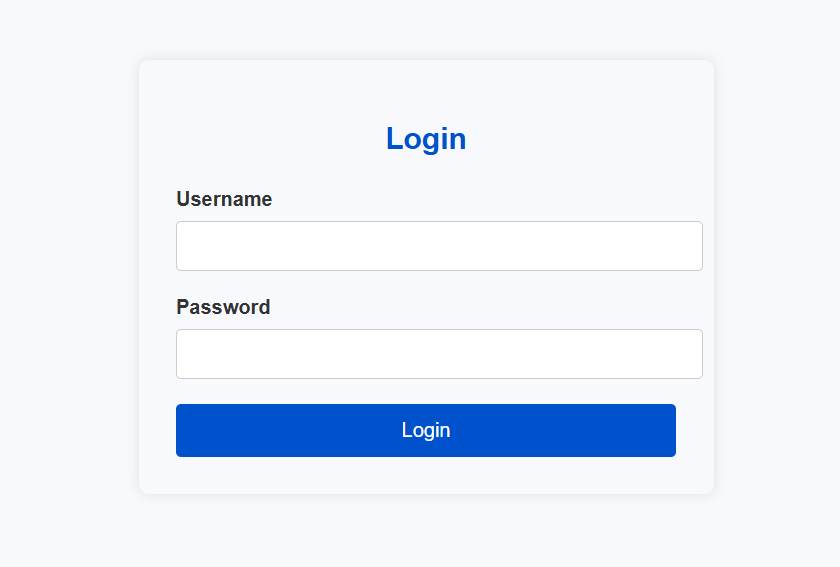
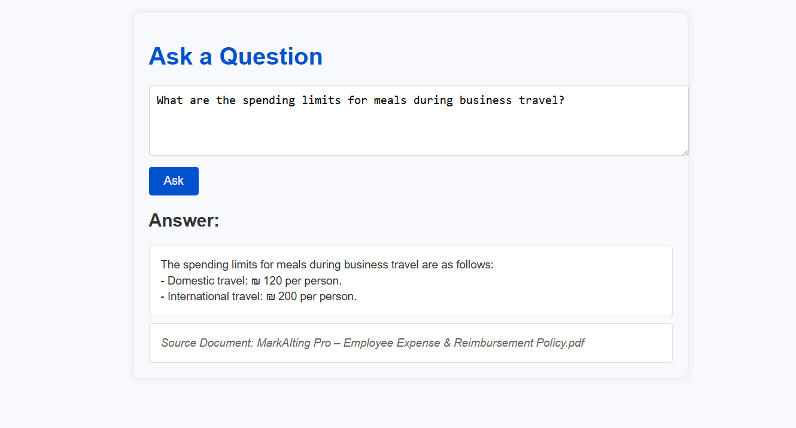

# 🧠 Mini RAG Chatbot (FastAPI + Docker)

🔗 **Live Demo:** [mini-rag-chatbot.onrender.com](https://mini-rag-chatbot.onrender.com)

## Project Description
A lightweight Retrieval-Augmented Generation (RAG) chatbot built with FastAPI and OpenAI, loading context from local PDFs.

---

## 🚀 Run the App (One Command)

1. Clone the repository:

```bash
git clone https://github.com/Evyatarashuri/Mini-RAG-Chatbot.git
cd Mini-RAG-Chatbot
```

2. Create the .env file in the root of the project and pre-fill it with example values.
> 🔐 **Important:** The `OPENAI_API_KEY` is required by the application to interact with the OpenAI API.  
> You must provide your own valid key. The other variables (`USER`, `PASS`, `DEBUG`) are used for local authentication and configuration.


Use one of the following commands based on your operating system:

🪟 Windows CMD:
```bash
echo OPENAI_API_KEY= > .env & echo USER=user >> .env & echo PASS=password >> .env & echo DEBUG=True >> .env
```

💠 Windows PowerShell:
```bash
echo OPENAI_API_KEY= > .env & echo USER=user >> .env & echo PASS=password >> .env & echo DEBUG=True >> .env
```

🍎 macOS / 🐧 Linux / Git Bash:
```bash
echo -e "OPENAI_API_KEY=\nUSER=user\nPASS=password\nDEBUG=True" > .env
```

After running the appropriate command, edit .env and fill in your actual OpenAI API key.


3. Running with Docker: Build & Run

🚨 Make sure Docker Desktop is running in the background before executing the following command.

```bash
docker build -t my-app . && docker run --env-file .env -p 8000:8000 my-app
```

Once running, the application will be accessible at:

[http://localhost:8000](http://localhost:8000)

---

## ✅ Features

- 🔐 Simple login system using environment-based credentials
    
- 🧠 Semantic search over PDF content (embedding-based)
    
- 🔄 Streaming responses from OpenAI API
    
- 📦 Fully containerized with Docker

---

## 💡 Sample Questions

Looking to test the chatbot quickly?

Check out [`example-questions.md`](example-questions.md) for a list of ready-to-use questions.

---

## 📸 Screenshots

### 🔐 Login Page


### 🧠 Ask Page

